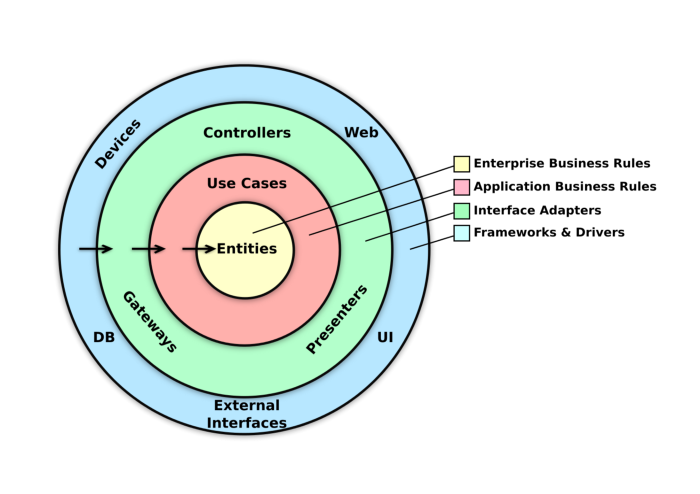

# App Architecture

## Model-ViewModel-View (MVVM)

The MVVM architectural pattern is used to separate the UI from the Business Logic and the data.
Like other software architectural patterns, the definitions and implementation of this pattern may vary between organizations or projects.

### Model
Responsible for handling the *business-specific logic* and data of the application.
The model provides interfaces for executing business logic and accessing data.
**Models** can take different formats between layers of the application. In the context of the MVVM pattern, the **ViewModel** serves as the Interface Adapter that interacts with the data layer and transforms this data in a format more convenient to be exposed to and consumed by the **View**.

### View

Responsible for displaying the state of the application to the user and providing an interface for the user to interact with.
The **View** observes the state exposed by the **ViewModel** and may use it to display information to the user.
The **View** delegates user events to the **ViewModel**
Views are implemented using *Jetpack Compose*.

### ViewModel

Responsible for executing *application-specific business logic*, exposing part of the state of the application (such as the Screen) to be observed on and rendered by the **View**.
Maintaining the state for the **View** by processing the interactions of the user and/or accessing the **Model** to create or transform this state.
The **ViewModel** exposes a state that can be observed by the View if needed to display information.
The **ViewModel** executes *application-specific logic* and may interact with the **Model** in order to create or transform this state.
ViewModels are implemented using *Android AAC ViewModel*.

# Application State Management

### Unidirectional Data Flow

The application’s architecture follows Unidirectional data flow.
The MVVM pattern helps facilitate this with the ViewModel exposing the state for the View to observe and consume, and exposing an interface to delegate the user’s events into it.

## Clean Archiecture

The **Clean Architecture** pattern is used for defining boundaries and the dependency rules.
The emphasis here is that the outermost layer can be easily swapped with a different framework/implementation detail without having to
change anything on the inner layers (the business logic).
The *interface adapters* serve as a bridge for converting data to the format most convenient to the layer. Below illustrates in general how data flows and is converted between layers:

### UseCase

The **UseCase** pattern is used to write an interface for communicating between the **ViewModel** and the **Model**.
A UseCase is responsible for executing the business logic of the application and returns a result of this execution. UseCases are designed to be reusable in different screens or flows and is independent of the View or ViewModel.

# Navigation with Jetpack Navigation

### Single Activity, Fragment-based Navigation

The app contains a single Activity for controlling the whole application UI, for which the Jetpack Navigation library is mainly designed.
Different screens are wrapped using Fragments and navigation between screens is automatically handled by the library.

### Single Back-stack Navigation
The application maintains a single back-stack for navigation, which adheres to the [Material Bottom Navigation Android Spec](https://material.io/components/bottom-navigation#behavior).

### Navigation as Application Logic

The **View** does not know where it navigated from and where it can navigate. All these navigation logic are delegated to the **ViewModel**,
the View being only responsible for rendering the current state and delegating any kind of UI event for the ViewModel to handle.
This approach is aligned with the unidirectional handling flow between state and events.

## Modularization

The modularization design follows the package-by-feature approach.

There are packages separated by Application, Features, Domains, and Libraries.

The **Application** module should be relatively sparse, and simply contains references to the feature modules for building/testing the
application.

The **Feature** module should be independent of other feature modules and have dependencies on only the domain/library modules

The **Domain** module contains shared business logic that can be distributed among multiple feature modules. (e.g. an Item Domain
module that contains item logic for Listing and ItemDetail)

The **Core-Library** module contains generalized logic, it should not contain business logic.

### Build Setup with Gradle Kotlin DSL

Dependency artifacts are defined in a separate file for reuse and can be accessed by any module to declare a dependency for itself.
For convenience, there are plugins written to group a common set of dependencies that can be easily applied to modules which avoid
redundant declaration across modules and helps apply a dependency in a logical group of modules by declaring once. For example, there
is *android-base.gradle.kts* which applies dependencies common to all android modules, *android-feature.gradle.kts* for feature-modules,
and *android-library.gradle.kts* for android library modules.
All of the versions of library dependencies are defined in the *version.properties* file. This allows changing versions without invalidating
Gradle tasks and otherwise causing them to rerun.

## Asynchronous programming
Kotlin Coroutines is used for asynchronous programming. 
